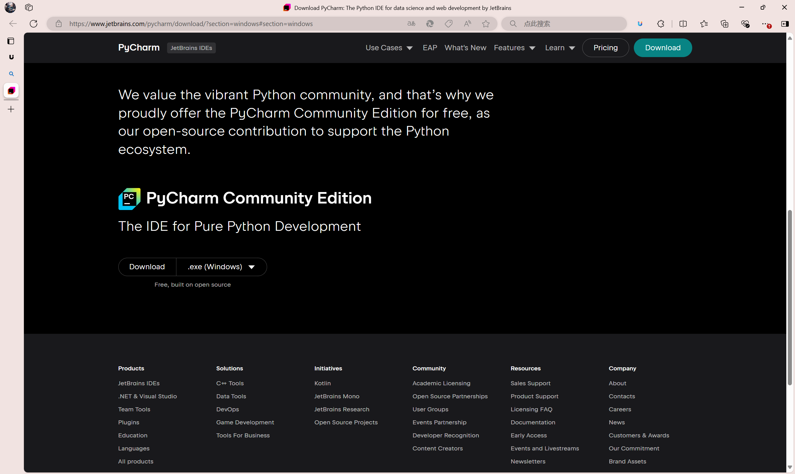

# README

>  上图是《明日方舟》的可爱猫猫“迷迭香”   $\uparrow$

欢迎使用本程序，本程序使用PyQt5作为框架，使用python构建了一个简单的桌面宠物小程序

该项目目前仅添加了来自游戏《明日方舟》的角色 ***迷迭香*** 与 ***阿米娅*** 的模型，下面的文档将会详细地为您讲述如何使用项目提供的程序去添加自己喜欢的角色，以及如何一起开发我们的项目

## 一、添加自己喜欢角色的Model并应用

我们在项目开发的初期就为自定义模型做好了准备，原理非常简单，我们不妨来看看项目目录的结构：

请注意，为了明日方舟爱好者的共同协作，该项目并未打包成 **.exe** 可执行文件，所以需要您自行安装 **pycharm** 或者其他的**IDE** & 我们的第三方包以运行我们的桌面宠物程序，请放心，这些操作非常简单，在文档中我们会详述如何安装**pycharm** 以及如何安装该项目所需的第三方包来运行我们可爱的小桌宠

### 准备工作-PyCharm的准备与包安装

1. 安装可以运行**python**的**IDE**（该文档中我们使用**pycharm**）

   首先，我们找到**pycharm**的官方网站，网站网址：`(https://www.jetbrains.com/pycharm/download/?section=windows#section=windows)`

   

   可以看到这里打开界面是 **PyCharm Professional** （专业版PyCharm）但这个需要付费，不付费的话只能试用30天

   我们向下浏览

   

   可以看到，伟大的 **JET Brains** 为我们提供了免费的社区版本，我们点击Download，将安装包任意保存，等待安装包下载

   由于服务器在外网，故下载网速可能较慢，我们这里在项目中提供社区版本的安装包：

   

   一路默认安装下来即可

2. 使用安装的PyCharm来打开我们的程序

   

   点击`Open`，打开您从 **Github** 克隆下来的项目路径，这样我们就可以看见我们的项目了

   

3. 确保你已经安装了`cv2`（OpenCV）、`os`、`numpy`和`tqdm`库。要是没有，就像给电脑施魔法一样，用`pip install`命令把它们安装好。比如：`pip install opencv-python`、`pip install tqdm`等。

   

   正常情况下您应该会出现下面的情况，莫慌，光标移到灰色的import语句之后点击`Install package`，IDE会自动助您安装未安装的包，其他情况皆是如此，速度可能有些慢，直到右下角出现：

   

   代表包安装成功，按照红色下划线提示，安装所有您缺失的包，我们可以进行下一步了

### 准备工作-模型资源的准备（以明日方舟Wiki提供的为例，其他途径的资源依此类推）

我们在浏览器中搜索`明日方舟Wiki`或使用我提供的超链接：[首页 - PRTS - 玩家共同构筑的明日方舟中文Wiki](https://prts.wiki/w/首页)

于搜索栏中搜索您喜爱的角色

点击载入干员模型

可以选择下载的webm背景色，如干员 **斯卡蒂** 的眼睛是红色，故我们使用绿色背景，同理，如果模型中存在绿色或者使用绿色底图抠图效果差，那么我们使用红色背景以防程序的误抠图，名称不用更改，尽可能保存webm资源在项目文件夹中

### 抠图步骤

1. 找到我们为您准备的抠图工具程序，有`切割 webm_green.py（切割绿色底）`和`切割 webm_red.py（切割红色底）`两个文件，同理，未安装包的按照上文所述操作安装第三方包

   

2. 打开对应的文件（绿色底用`切割 webm_green.py`，红色底用`切割 webm_red.py`）

3. 在文件里找到`video_path`这一行，把后面的文件名改成你下载的 webm 视频的实际路径。比如`video_path = "res/阿米娅 - 默认 - 基建 - Relax - x1.webm"`，改成你的视频文件名哦。

4. 再找到`output_folder`这一行，它是用来指定输出图片的文件夹路径的。你可以根据自己的喜好设置，但要记得保持格式正确哦，比如`output_folder = "res/你的角色名字_frames/动作名称"`。这里的 “动作名称” 可以是`idle`（闲置）、`interact`（交互）、`move`（移动）、`stun`（眩晕）、`sleep`（睡觉）、`relax`（放松）等等，对应角色的不同状态。

5. 请参考我给出的模型存储，例如`amiya_frames`和`rosmontis_frames`的格式，注意模型文件夹里的动作状态命名请不要更改，注意`sound`文件夹里的音频也要存放哦，音频同样是在Wiki当中去找

   

   做好这一切后我们就可以在运行桌面宠物的时候通过右键点击切换Model来进行模型的切换了，需要重启程序以切换Model，设置参数保存在了`settings.json`当中。

   

   

   ***Tips:***  当点击小宠物一定次数后，可能有小彩蛋会出现哦，不妨去试试呢

   

## 二、图片和音频文件存储规范

为了让我们的桌面宠物程序开心地运行，图片和音频文件要按照规范存储哦：

### 图片文件

1. 角色的每个动作都要有自己的文件夹，比如`idle`、`interact`、`move`等文件夹，就像每个动作都有自己的小房间。
2. 图片文件名要像`frame_xxxx.png`这样，`xxxx`是四位数字，表示帧的序号，从 0000 开始哦。这样宠物在表演各种动作的时候，程序就能顺利找到对应的图片啦。

### 音频文件

1. 背景音乐（bgm）文件要命名为`bgm.wav`，放在`res/你的角色名字_frames/sound`文件夹里。当宠物在桌面上闲逛时，就会播放美妙的背景音乐啦。
2. 其他音效文件，比如`start.wav`（启动音效）、`interact.wav`（交互音效）、`move.wav`（移动音效）、`stun.wav`（眩晕音效）、`sleep.wav`（睡觉音效）、`wakeup.wav`（唤醒音效）、`settings.wav`（设置音效）等，也要放在`res/你的角色名字_frames/sound`文件夹里，每个音效对应相应的动作或事件，让宠物的世界更加生动有趣。

## 三、为项目做贡献（提交到 Github）

如果你是个编程小天才，想给我们的桌面宠物项目添砖加瓦，欢迎把你的代码提交到 Github 上哦！

### 前期准备

1. 先在 Github 上（https://github.com/Revelreal/Arkpet）找到我们的项目仓库，就像找到一个装满宝藏的城堡。
2. 点击右上角的 “Fork” 按钮，把项目仓库复制一份到你自己的 Github 账号下，这就是你的魔法实验室啦。
3. 把你 Fork 后的仓库克隆到本地电脑，用`git clone`命令，就像把魔法实验室搬到你的电脑里一样。比如：`git clone https://github.com/你的 Github 用户名/Arkpet.git`。

### 代码修改与提交

1. 在本地的项目文件夹里，你就可以像个魔法师一样修改代码啦。添加新功能、修复小 bug，随你发挥创意。
2. 改好代码后，用`git add`命令把你修改的文件添加到暂存区，就像把魔法材料收集起来一样。比如：`git add.`（这个点表示添加所有修改的文件哦）。
3. 然后用`git commit`命令提交你的修改，写上简洁明了的注释，告诉大家你做了什么神奇的改变。比如：`git commit -m "修复了宠物移动时偶尔卡顿的小 bug"`。
4. 最后用`git push`命令把你的修改推送到你 Github 账号下的仓库，就像把你的魔法成果展示给全世界一样。比如：`git push origin master`（这里的`master`是你的主分支名称，如果不一样要改成你自己的分支名哦）。
5. 回到 Github 上你 Fork 的项目页面，点击 “New pull request” 按钮，像提交魔法作品一样把你的修改提交给我们的主项目。写清楚你的修改内容和目的，等待我们的审核和合并吧！
